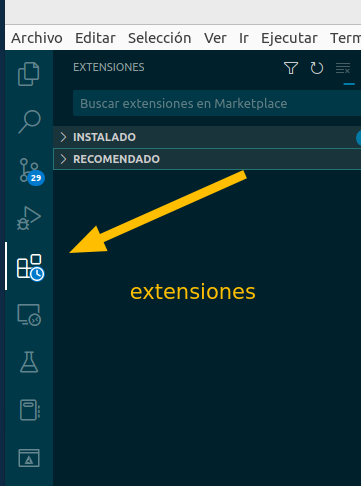
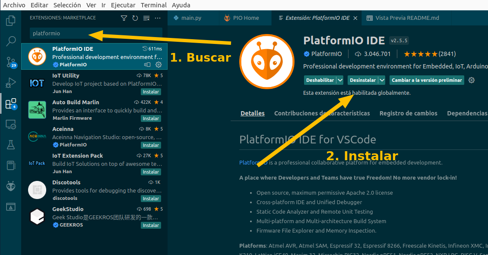
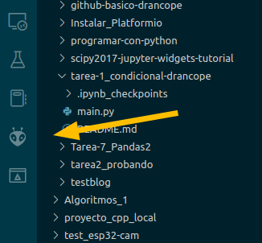
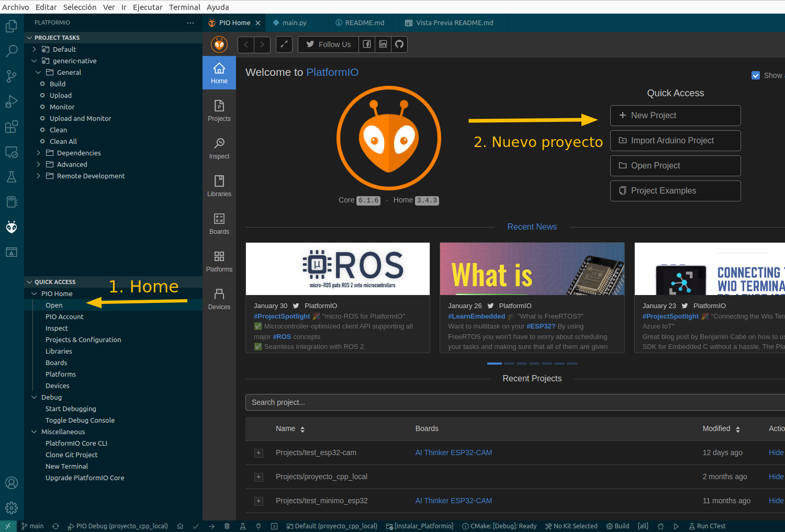
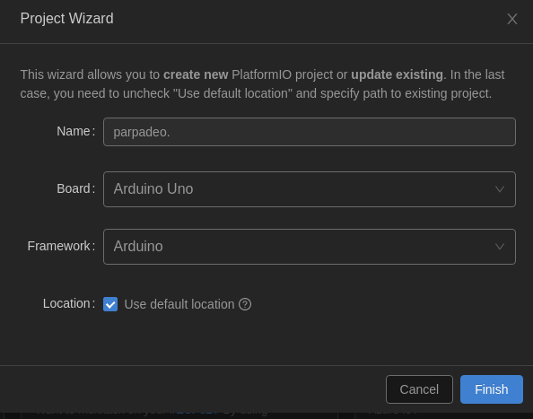
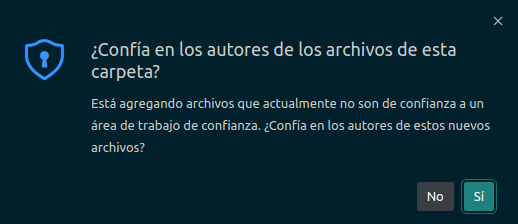
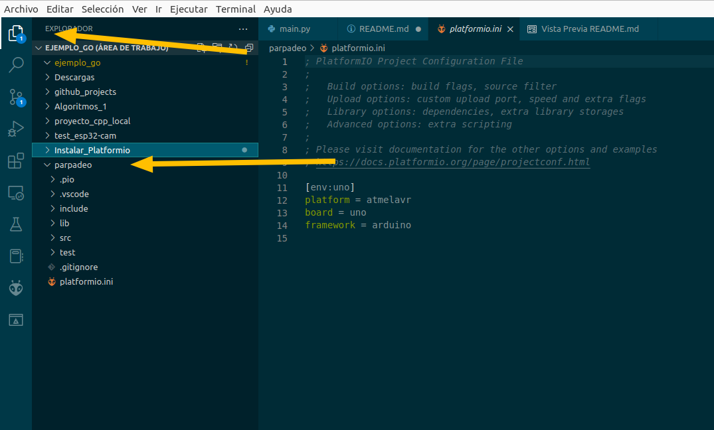
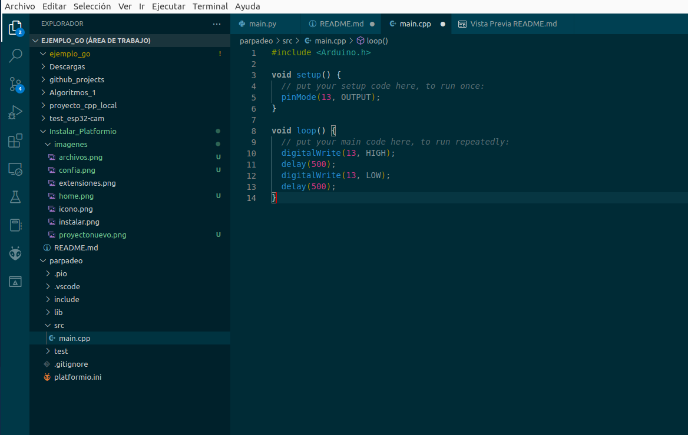
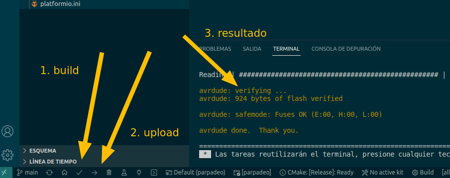

# Instalar_Platformio
Instrucciones para empezar con Arduino en VSCode

**Platformio** es un programa que instala un entorno de programación de microcontroladores aislado para cada proyecto que abrimos en él. Permite trabajar con miles de microcontroladores distintos utilizando el mismo IDE (VsCode, por ejemplo), en lugar de un IDE distinto para cada tarjeta distinta, y usar el lenguaje que nos resulte más conveniente, si está disponible. 

También nos descarga las librerías de extensión que nos hagan falta, manteniéndolas aisladas de las librerías de otros proyectos.

## Paso 1: Instalar el driver ch340 para poder manejar los arduinos con ese chip.
Hay algunas placas Arduino que utilizan el diseño original de los fabricantes para controlar el puerto USB de la placa. Con esas no hay que hacer nada. Normalmente **Linux** ya incorpora este driver, así que no suele ser necesario, aunque es posible que haya que añadir al usuario que va a usar vscode al grupo *dialout*. Para esto, siendo administrador, hay que teclear la siguiente instrucción en el terminal: <code>sudo usermod -a -G dialout usuario</code>

Hay otras placas que usan el chip ch340 para conectarse por USB al ordenador. Según el sistema operativo, puede ser necesario instalar el controlador de este chip en el ordenador. Es necesario para usar el programa IDE de Arduino.

Se usarán las instrucciones de esta página web o de cualquier otra que busquéis en Internet:
[instalar driver ch340](https://programmerclick.com/article/87861702877/)

Ocasionalmente es posible que haya que desinstalar un gestor de dispositivos USB que interfiere con los instalados por Ubuntu. Se trata del paquete brltty.

Después de esto podríamos descargar y probar el funcionamiento del IDE de Arduino, pero vamos a ir a otra opción a continuación.

## Paso 2: Buscar Platformio en las extensiones de VSCode.
Abrimos el programa y vamos a la pestaña de extensiones:

Allí buscaremos la extensión y la instalamos:

Al menos en Linux, **Platformio** necesita la librería **distutils** de **Python**. En ubuntu debe instalarse con permisos de administrador con la instrucción <code>sudo apt install python3-distutils</code>

Es probable que haya que reiniciar el sistema antes de que funcione.

## Paso 3: panel *home* y proyecto nuevo.
Platformio nos instala una nueva pestaña de herramientas, con la imagen de una hormiga:

Esta herramienta nos abre un menú en el que elegimos *Home/open*, y esto abre una hoja de trabajo grande, que es el panel de bienvenida de Platformio. La primera operación será crear un proyecto nuevo.

El programa nos solicita un nombre para el proyecto y una *plataforma* de programación, es decir, qué tarjeta tenemos. Seleccionaremos el Arduino UNO.

También tenemos que *confiar* en este proyecto que se va a crear y su autor.

Platformio nos creará unas cuantas carpetas y archivos dentro de una carpeta especial de la carpeta de usuario. Si hubiéramos quitado en la pantalla de "crear" el tick azul de abajo, podíamos usar cualquier carpeta, pero no es preciso en este ejemplo. Los archivos de programa están dentro de la carpeta **src**. El archivo **platformio.ini**, que se acaba de abrir, es el de configuración del proyecto. La carpeta lib es donde Platformio descargará las bibliotecas de funciones que hagan falta.

## Paso 4: encender y apagar un LED
Abre el archivo **main.cpp** que hay en la carpeta **src**. Copia el texto que ves en la imagen.

Este lenguaje es una versión de *C++* adaptado al Arduino. Hay que fijarse en cada llave, paréntesis y punto y coma. Cualquier error impide que funcione la conversión del programa a código máquina.

Una vez escrito y guardado, hay que pulsar en los botones adecuados, **build** y **upload**

Si hay algún error en el programa, saldrán mensajes en el terminal. Se pueden leer, interpretar, buscar en Internet y corregir.
